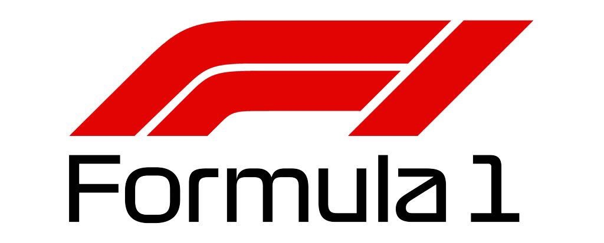

# formula-1-lserravite0426
This project was created during S.Y. 2019/2020.

## Contributor
Serravite Lorenzo - 5B INF - S.Y. 2019/20 - IIS G. Vallauri - Fossano (CN)<br>
Teachers: Cambieri Oscar, Belliardo Diego

## Introduction
The folder contains all projects about Formula1 solution.
```
root
  +--- FormulaOneBacthConsoleProject
  +--- FormulaOneCrudFormProject
  +--- FormulaOneDll
  +--- FormulaOneWebAPIProject
  +--- FormulaOneWebFormProject
  +--- assets
  +--- data
  +--- formulaonevue
  + FormulaOneSolution.sln
  + MODELS.md
  + README.md
```

## Prerequisites
- [Visual Studio](https://docs.microsoft.com/it-it/visualstudio/install/install-visual-studio?view=vs-2019)
- [npm](https://npmjs.com/)
## Languages
- [C#](https://www.google.com/url?sa=t&rct=j&q=&esrc=s&source=web&cd=1&cad=rja&uact=8&ved=2ahUKEwjPkcmpnazpAhWGKewKHTUPCDAQFjAAegQIARAB&url=https%3A%2F%2Fdocs.microsoft.com%2Fit-it%2Fdotnet%2Fcsharp%2Fgetting-started%2F&usg=AOvVaw1LxYKYITulVD7qrq9VtlXi)
- [Vue.js](https://www.vuejs.org/)
- [Vuetify](https://vuetifyjs.com/)

## DB schema


## How to clone
- Clone project into desired folder.
- Open `FormulaOneSolution.sln`.
- Check DB connection string in project  `FormulaOneDll` in `DBTools` class. The DB may be located into `D:\Dati` and have an active `D:\Dati` connection. If not, create it in SQL Server or simply change the connection string.
- Clone data directory's content in `D:\Dati`.

## How to start `formulaonevue`
- Open a terminal.
- Write the command `npm i -g @vue/cli` and press enter.
- Enter in `formulaonevue` directory.
- Open a terminal.
- Write the command `npm i` and press enter.
- Change in `src/main.js` the `$url` value with the Web API server URL.
- Write the command `npm run serve` and press enter.